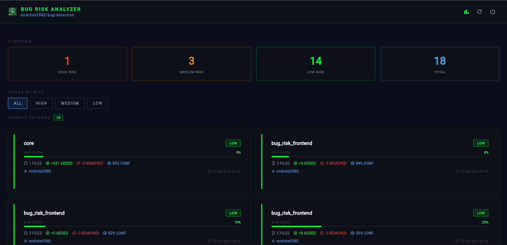
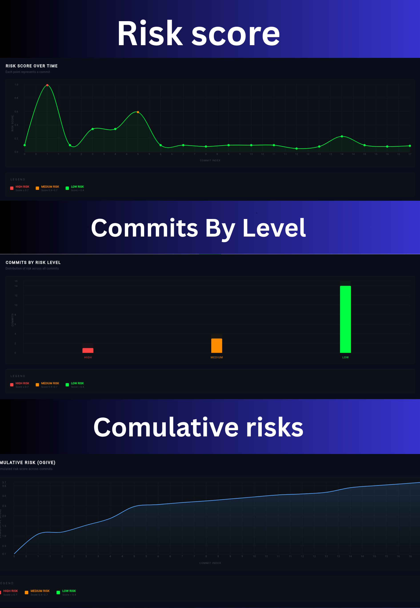
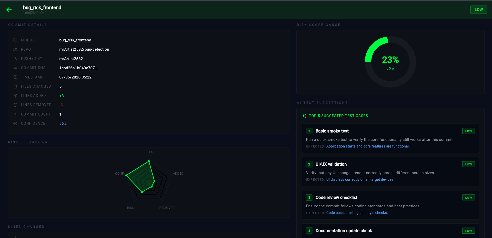

# 🐞 AI-Based Bug Detection System

> Intelligent bug prediction and code quality analysis platform powered by AI & Machine Learning.

<p align="center">
  
  
  
  
</p>

---

# 📌 Project Summary

AI-Based Bug Detection System is a smart developer-focused platform that predicts potential bugs in software modules before deployment using Machine Learning techniques.

The system analyzes:
- Source code metrics
- Commit history
- Complexity patterns
- Bug-prone modules
- Risk scores

It helps developers identify vulnerable areas in projects and improve software quality proactively.

---

# 🎬 Demo Video

<p align="center">
  <a href="https://drive.google.com/file/d/1gCTfTC0x4RUnDpB6YJdu0om46zlKM0R4/view?usp=sharing" target="_blank">
    
  </a>
</p>

> Click the button above to watch the full demo video on Google Drive.

---

# 📸 Screenshots

## Dashboard


## Risk Score Heatmap


## Risk Analysis


---

# 🚀 Features

## ✅ Core Features

- 🔍 AI-based Bug Prediction
- 📊 Risk Score Analysis
- 🧠 Machine Learning Integration
- 📈 Module Heatmap Visualization
- ⚡ Real-time Analysis
- 🛠 Developer Friendly Dashboard
- 📂 Repository Scanning
- 📉 Bug Probability Detection
- 📋 Detailed Reports

---

# 🧠 How It Works

The system follows these steps:

1. Connect your GitHub repository
2. Push code commits as usual
3. Webhook triggers automatic analysis
4. ML model predicts bug risk per commit
5. Dashboard shows risk scores and test suggestions
6. AI generates top 5 test cases per commit

---

# 🏗️ System Architecture

```text
             ┌─────────────────┐
             │  GitHub Repo    │
             └────────┬────────┘
                      │ Webhook (push event)
                      ▼
          ┌─────────────────────┐
          │  Node.js Backend    │
          │  (Express + MongoDB)│
          └────────┬────────────┘
                   │
                   ▼
          ┌─────────────────────┐
          │  ML Service         │
          │  (Python + FastAPI) │
          └────────┬────────────┘
                   │
                   ▼
          ┌─────────────────────┐
          │  Risk Analysis      │
          │  + Gemini AI        │
          └────────┬────────────┘
                   │
                   ▼
          ┌─────────────────────┐
          │  Flutter Dashboard  │
          └─────────────────────┘
```

---

# 🛠 Tech Stack

| Layer | Technology |
|---|---|
| Frontend | Flutter, Dart |
| Backend | Node.js, Express |
| ML Service | Python, FastAPI, Scikit-learn |
| Database | MongoDB Atlas |
| Auth | Firebase Authentication |
| AI Suggestions | Google Gemini API |
| Deployment | Render (backend), Firebase Hosting (frontend) |

---

# ⚙️ Installation & Setup

## 📥 Clone Repository

```bash
git clone https://github.com/mrArtist2582/bug-detection.git
cd bug-detection
```

---

## 🐍 ML Service Setup

```bash
cd ml-service
pip install -r requirements.txt
python -m uvicorn main:app --host 0.0.0.0 --port 8000
```

---

## 🟢 Backend Setup

```bash
cd bug-risk-backend
npm install
```

Create `.env` file:

```env
PORT=5000
GITHUB_TOKEN=your_github_token
DEPLOYED_URL=https://your-backend.onrender.com
ML_SERVICE_URL=http://localhost:8000
MONGO_URI=your_mongodb_uri
SETUP_SECRET=your_secret
FIREBASE_PROJECT_ID=your_project_id
FIREBASE_CLIENT_EMAIL=your_client_email
FIREBASE_PRIVATE_KEY=your_private_key
GEMINI_API_KEY=your_gemini_key
```

```bash
npm start
```

---

## 📱 Flutter Frontend Setup

```bash
cd bug_risk_frontend
flutter pub get
flutterfire configure
flutter run
```

---

# 📂 Project Structure

```text
bug-detection/
│
├── bug-risk-backend/
│   ├── middleware/
│   ├── models/
│   ├── routes/
│   ├── services/
│   ├── utils/
│   └── server.js
│
├── ml-service/
│   ├── main.py
│   ├── train.py
│   ├── model.pkl
│   └── requirements.txt
│
├── bug_risk_frontend/
│   ├── lib/
│   │   ├── models/
│   │   ├── screens/
│   │   ├── services/
│   │   └── widgets/
│   └── pubspec.yaml
│
└── assets/
    ├── dashboard.png
    ├── heatmap.png
    └── risk-analysis.png
```

---

# 📊 Future Improvements

- 🔥 Multi-repo support per user
- ☁️ Cloud Deployment scaling
- 🤖 Deep Learning Models
- 📡 CI/CD Monitoring
- 🧩 VS Code Extension
- 📈 Advanced Analytics
- 🛡 Security Vulnerability Detection

---

# 🎯 Use Cases

- Software Quality Assurance
- Bug Risk Prediction
- Enterprise Code Review
- CI/CD Pipelines
- Developer Productivity
- Academic Research Projects

---

# 🤝 Contribution

Contributions are welcome!

1. Fork the repository
2. Create your feature branch: `git checkout -b feature-name`
3. Commit your changes: `git commit -m "Added new feature"`
4. Push to branch: `git push origin feature-name`
5. Open Pull Request

---

# 📄 License

This project is licensed under the MIT License.

---

# 👨‍💻 Author

**Kashish** — Flutter Developer & AI Enthusiast

- GitHub: [@mrArtist2582](https://github.com/mrArtist2582)

---

<p align="center">
  Made with ❤️ using Flutter + Node.js + Python + AI
</p>
